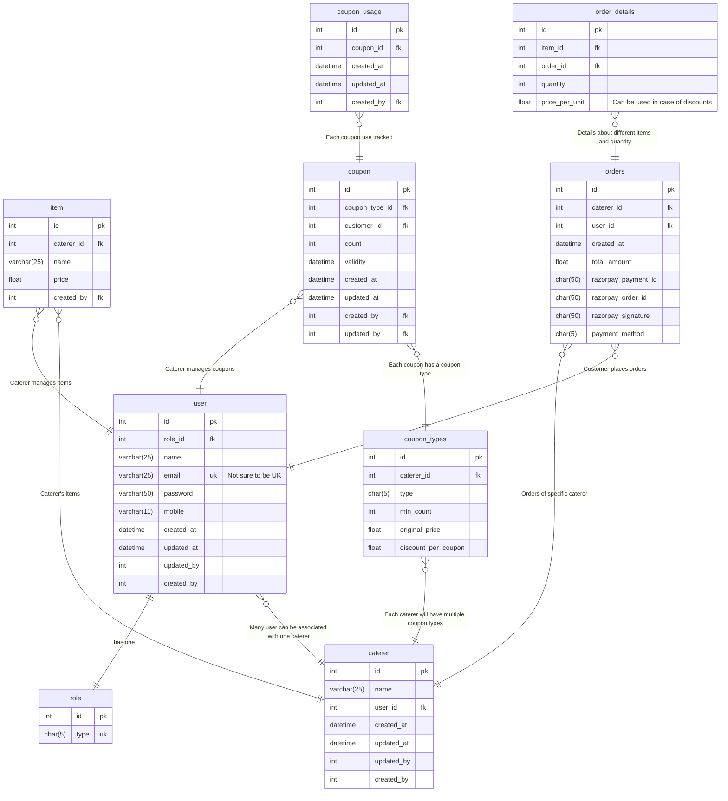

```mermaid
erDiagram
    user {
        int id pk
        int role_id fk
        varchar(25) name
        varchar(25) email uk "Not sure to be UK"
        varchar(50) password
        varchar(11) mobile
        datetime created_at
        datetime updated_at
        int updated_by
        int created_by
    }

    caterer {
        int id pk
        varchar(25) name
        int user_id fk
        datetime created_at
        datetime updated_at
        int updated_by
        int created_by
    }

    role {
        int id pk
        char(5) type uk
    }

    item {
        int id pk
        int caterer_id fk
        varchar(25) name
        float price
        int created_by fk
    }

    coupon_types {
        int id pk
        int caterer_id fk
        char(5) type
        int min_count
        float original_price
        float discount_per_coupon
    }

    coupon {
        int id pk
        int coupon_type_id fk
        int customer_id fk
        int count
        datetime validity
        datetime created_at
        datetime updated_at
        int created_by fk
        int updated_by fk
    }

    orders {
        int id pk
        int caterer_id fk
        int user_id fk
        %% int item_id fk
        datetime created_at
        float total_amount
        char(50) razorpay_payment_id
        char(50) razorpay_order_id
        char(50) razorpay_signature
        char(5) payment_method
    }

    order_details {
        int id pk
        int item_id fk
        int order_id fk
        int quantity
        float price_per_unit "Can be used in case of discounts"
    }

    coupon_usage {
        int id pk
        int coupon_id fk
        datetime created_at
        datetime updated_at
        int created_by fk
    }

    user ||--|| role: "has one"
    user }o--|| caterer: "Many user can be associated with one caterer"
    item }o--|| user : "Caterer manages items"
    item }o--|| caterer: "Caterer's items"
    orders }o--|| caterer: "Orders of specific caterer"
    coupon }o--|| user: "Caterer manages coupons"
    orders }o--|| user: "Customer places orders"
    order_details }o--|| orders: "Details about different items and quantity"
    coupon }o--|| coupon_types: "Each coupon has a coupon type"
    coupon_types }o--|| caterer: "Each caterer will have multiple coupon types"
    coupon_usage }o--|| coupon: "Each coupon use tracked"
```
