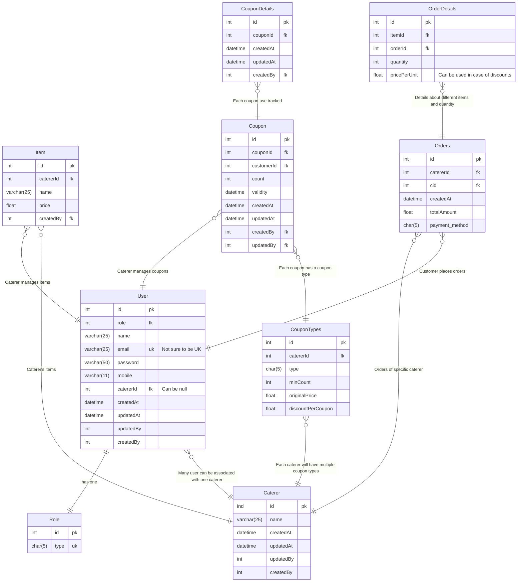

```mermaid
erDiagram
    User {
        int id pk
        int role fk
        varchar(25) name
        varchar(25) email uk "Not sure to be UK"
        varchar(50) password
        varchar(11) mobile
        int catererId fk "Can be null"
        datetime createdAt
        datetime updatedAt
        int updatedBy
        int createdBy
    }

    Caterer {
        ind id pk
        varchar(25) name
        datetime createdAt
        datetime updatedAt
        int updatedBy
        int createdBy
    }

    Role {
        int id pk
        char(5) type uk
    }

    Item {
        int id pk
        int catererId fk
        varchar(25) name
        float price
        int createdBy fk
    }

    CouponTypes {
        int id pk
        int catererId fk
        char(5) type
        int minCount
        float originalPrice
        float discountPerCoupon
    }

    Coupon {
        int id pk
        int couponId fk
        int customerId fk
        int count
        datetime validity
        datetime createdAt
        datetime updatedAt
        int createdBy fk
        int updatedBy fk
    }

    Orders {
        int id pk
        int catererId fk
        int cid fk
        %% int itemId fk
        datetime createdAt
        float totalAmount
        char(5) payment_method
    }

    OrderDetails {
        int id pk
        int itemId fk
        int orderId fk
        int quantity
        float pricePerUnit "Can be used in case of discounts"
    }

    CouponDetails {
        int id pk
        int couponId fk
        datetime createdAt
        datetime updatedAt
        int createdBy fk
    }

    User ||--|| Role: "has one"
    User }o--|| Caterer: "Many user can be associated with one caterer"
    Item }o--|| User : "Caterer manages items"
    Item }o--|| Caterer: "Caterer's items"
    Orders }o--|| Caterer: "Orders of specific caterer"
    Coupon }o--|| User: "Caterer manages coupons"
    Orders }o--|| User: "Customer places orders"
    OrderDetails }o--|| Orders: "Details about different items and quantity"
    Coupon }o--|| CouponTypes: "Each coupon has a coupon type"
    CouponTypes }o--|| Caterer: "Each caterer will have multiple coupon types"
    CouponDetails }o--|| Coupon: "Each coupon use tracked"
```
